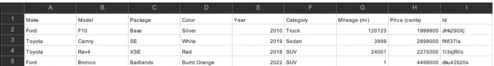

## Coding Challenge 

In preparation for our technical interview, we'd like you to implement a very basic microservice for getting and updating information about “cars”.  The implementation should consist of a RESTful OpenAPI contract and a matching HTTP Go implementation.  You will be asked to demo your application by running it locally.  We are not looking for a production-ready application, but be prepared to discuss your design, code, and TODOs.

### Contract

We'd like to see the application host four HTTP endpoints, returning JSON where applicable.  Documents these endpoints using OpenAPI.
1.	GET endpoint to retrieve an existing car
2.	GET endpoint to retrieve the list of cars
3.	POST endpoint to create a new car
4.	PUT endpoint to update an existing car

### API

Write a Golang implementation of the contract.  **Please limit your implementation to the standard libraries including net/http.**

We can assume that this is an internal API that has already been authenticated and authorized.  Do not worry about security in that sense.

For persistence, in-memory is sufficient.  There is no requirement to persist cars between application runs.

Observability is an important part of an application. Implement some aspect of observability whether it is logging, metrics, or tracing.

Finally, please include some automated testing of your endpoints.

### Sample Dataset 

Below is an example dataset for your reference.

